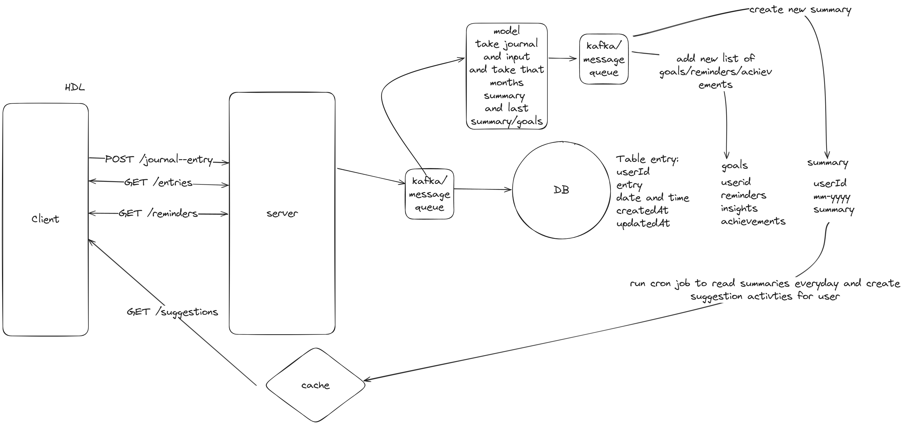

# 📝 Journaling App with AI Integration

A modern journaling application that leverages AI to generate insights, summaries, and recommendations based on user entries.

## 🚀 Features

- **Express.js Backend** – Handles user requests and manages journal entries efficiently.
- **BullMQ for Task Queueing** – Manages tasks like data saving, AI summarization, and goal generation.
- **AI-Powered Insights** – Uses Google Gemini API to analyze journal entries and generate meaningful insights.
- **Optimized Performance** – Implements Redis for caching, rate-limiting, and batch processing.
- **Automated AI Summaries** – Cron jobs run weekly and monthly to generate reflections and summaries.
- **Fault Tolerance** – API calls have automatic retries to handle temporary failures.
- **Efficient Database Operations** – Uses Prisma ORM with indexed tables for faster queries.

## 🛠️ Tech Stack

- **Backend:** Express.js, Node.js
- **Queueing:** BullMQ (Redis-based)
- **AI Integration:** Google Gemini API
- **Database:** PostgreSQL (via Prisma ORM)
- **Caching & Rate Limiting:** Redis
- **Task Automation:** Cron Jobs

## Design


## 📌 Installation

1. Clone the repository:
   ```
   git clone https://github.com/Suryodaya27/ai-journal-backend.git
   cd ai-journal-backend
   npm install
   ```
